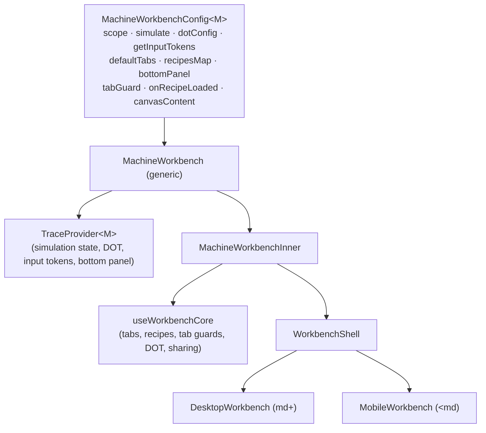

# Workbench

The Workbench is the central interactive editor for NFA, PDA, and TM machines. It wires together code editing, canvas visualization (NFA only), simulation/trace playback, test suites, and recipe loading into a single composable shell. Each machine type is a thin config object handed to a shared generic `MachineWorkbench` container — adding a new machine variant means writing a config, not subclassing anything.

## File Map

| File | Role |
|---|---|
| `types.ts` | Core types: `TabId`, `WorkbenchLogic<M>`, `EnabledTabs`, `ConfirmModalConfig`, `TabGuardResult` |
| `utils.ts` | Tab helpers (`buildTabs`, `isTabEnabled`, `getInitialTab`), `buildSlidingWindowTokens` for trace token generation, `buildSingleStreamInputTokens` for single-stream machines |
| `MachineWorkbench.tsx` | Generic container — composes `TraceProvider` + `MachineWorkbenchInner`, wires config to `useWorkbenchCore`. Exports `MachineWorkbenchConfig<M>` |
| `useWorkbenchCore.ts` | Central state hook: tab management, recipe loading, tab guards, DOT sharing, compilation on hydration |
| `WorkbenchShell.tsx` | Responsive UI shell — `DesktopWorkbench` (resizable panels) + `MobileWorkbench` (tab-switched layout) |
| `Workbench.nfa.tsx` | NFA config + `getNfaInputTokens` + `NFAComponent` |
| `Workbench.pda.tsx` | PDA config + `getPdaInputTokens` + `PDAComponent` |
| `Workbench.tm.tsx` | TM config + `getTmInputTokens` + `TMComponent` |
| `index.ts` | Public re-exports: `Workbench.NFA/PDA/TM`, `MachineWorkbench`, `MachineWorkbenchConfig` |

## Architecture

`MachineWorkbenchInner` assembles a flat `WorkbenchLogic<M>` record from `useWorkbenchCore` plus hooks (`useCompiledMachine`, `useEditorState`, `useTestSuite`) and passes it to `WorkbenchShell`. The shell is fully decoupled from machine specifics — it only knows `WorkbenchLogic<M>`.

## Adding a New Machine Variant

1. Create `Workbench.xyz.tsx`
2. Define a `MachineWorkbenchConfig<XYZ>` object:
   - `scope`: your new `MachineType` value (also requires store + worker protocol changes)
   - `simulate`: wraps your simulator, returns `{ accepted, trace, ... }`
   - `dotConfig`: visualization config for Graphviz
   - `getInputTokens`: use `buildSingleStreamInputTokens(args, 'xyz')` for single-input machines, or call `buildSlidingWindowTokens` directly for multi-tape/multi-stream
   - `defaultTabs`: set `canvas: false` unless your variant has a canvas editor
   - `recipesMap`: a `Record<string, Recipe>` of bundled examples
3. Export a component that passes the config to `<MachineWorkbench config={xyzConfig} ... />`
4. Re-export from `index.ts` as `Workbench.XYZ`

## Tab System

**Tab IDs:** `code` | `canvas` | `debug`

**`EnabledTabs`** controls visibility. Setting a tab to `false` hides it entirely (e.g. PDA and TM set `canvas: false`).

**`requestTabChange(tab)`** is the only way to switch tabs. It runs the current `tabGuard` first:
- Guard returns `null` → switch immediately
- Guard returns `TabGuardResult` → open a confirmation modal; switch only on confirm

**`tabGuardRef` pattern:** `useWorkbenchCore` stores the guard in a `ref` and updates it in a `useEffect`. This lets `requestTabChange` be a stable `useCallback` (depends only on `enabledTabs`) while still seeing the latest guard function on every call — avoiding stale closures without listing the guard as a dependency.

## Recipe System

A `Recipe` has `{ label, path, tests }`. `path` is a URL to the raw source file; `tests` is a pre-populated test suite.

`applyRecipe(recipeKey)`:
1. Fetches the code at `recipe.path`
2. Calls `onRecipeLoaded` (variant hook — NFA uses this to exit canvas tab before overwriting the NFA)
3. Sets tests, sets editor value, clears errors, compiles

The `initialRecipe` prop triggers `applyRecipe` once on mount (guarded by a `hasAppliedInitialRecipeRef` to survive React StrictMode double-invocation).

## Trace Token Generation

**`buildSlidingWindowTokens`** (`utils.ts`) renders a fixed-size window of tokens (default 81) centered on `centerIndex`. For each slot it calls:
- `makeKey(charIndex, slotIndex)` → React key
- `resolveToken(charIndex, slotIndex)` → `{ text, className, isActive?, row? }` or `null` for an empty slot

**`buildSingleStreamInputTokens(args, keyPrefix)`** is the shared implementation for NFA and PDA. Both read a single `args.input` string, center on `args.step`, and apply the same three-state styling: active (lavender highlight), past (surface2), future (subtext1). The `keyPrefix` ('nfa' or 'pda') keeps React keys unique.

**`getTmInputTokens`** (`Workbench.tm.tsx`) diverges intentionally: it iterates over `args.current.tapes`, finds the active cell per tape via bracket markers, and adds a `row` field to each token. The structural similarity to the single-stream version is coincidental — forced into the same helper would add more complexity than it removes.

## Key Design Decisions

- **Config objects, not classes.** `MachineWorkbenchConfig` is a plain object. Variants are additive — no inheritance hierarchy to navigate.
- **`WorkbenchLogic<M>` interface.** `MachineWorkbenchInner` assembles this flat record and hands it to `WorkbenchShell`. The shell has zero knowledge of machine types, hooks, or config — it only reads `WorkbenchLogic<M>`.
- **`tabGuardRef` pattern.** Described above — stable callback, fresh guard. The pattern appears in `useWorkbenchCore.ts`.
- **Compile on hydration, not on mount.** `useWorkbenchCore` subscribes to `useAutomataStore.persist.onFinishHydration` so the machine is always populated, regardless of which tab the user lands on or how the page was loaded.
